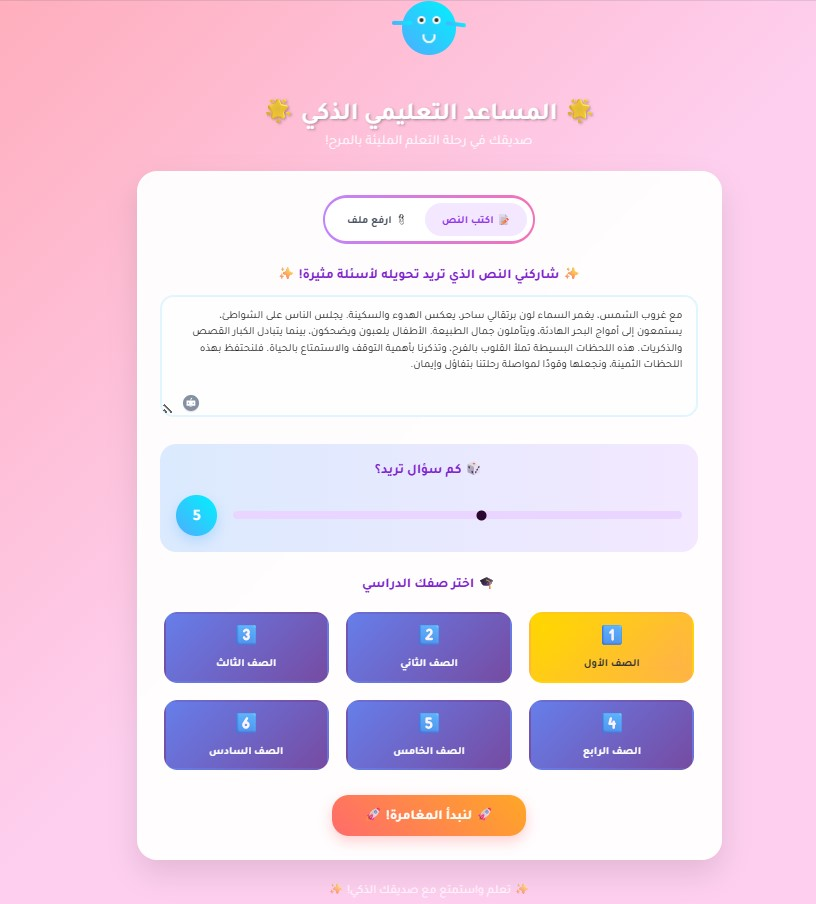
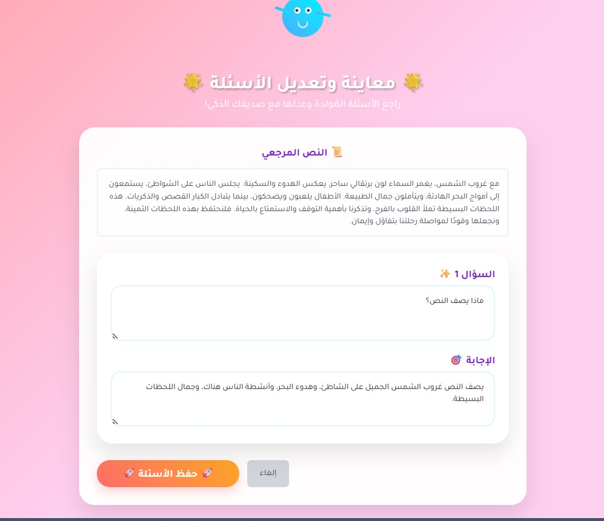
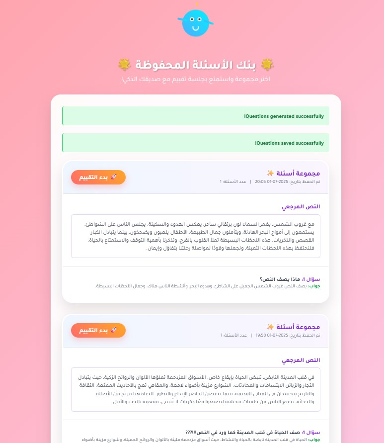
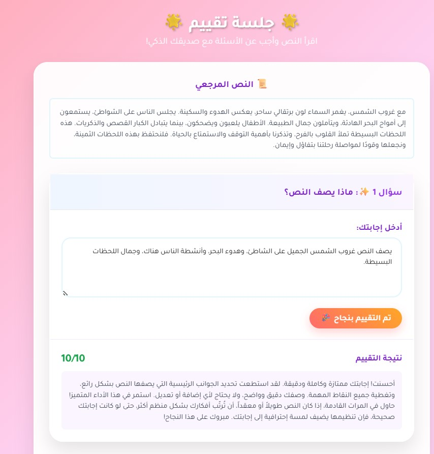
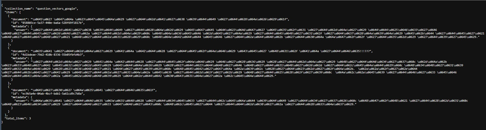

# Arabic Educational Assistant with Advanced AI & Deep Learning

An intelligent educational tool powered by state-of-the-art AI and deep learning technologies to generate and evaluate educational questions in Arabic using Google's Gemini AI model, semantic similarity scoring, and vector embeddings.

## 🤖 AI & Deep Learning Architecture

### Core AI Models

#### 1. **Google Gemini 1.5 Flash (Latest)**
- **Model Type**: Large Language Model (LLM)
- **Purpose**: Question and answer generation from Arabic text
- **Capabilities**: 
  - Natural language understanding in Arabic
  - Context-aware question generation
  - Structured JSON output for consistent formatting
  - Multi-turn conversation support
- **Technical Details**:
  - Model: `models/gemini-1.5-flash-latest`
  - Token Limit: 1M tokens
  - Response Format: JSON array with question-answer pairs
  - Prompt Engineering: Optimized for educational content

#### 2. **Sentence Transformers - Multilingual Model**
- **Model**: `paraphrase-multilingual-mpnet-base-v2`
- **Architecture**: Transformer-based neural network
- **Purpose**: Semantic similarity scoring for answer evaluation
- **Capabilities**:
  - Multilingual text embeddings (supports Arabic)
  - Semantic understanding of educational content
  - Cosine similarity computation
  - Real-time evaluation scoring

#### 3. **ChromaDB with Google Embeddings**
- **Vector Database**: ChromaDB for semantic search
- **Embedding Function**: Google's Generative AI Embedding API
- **Purpose**: RAG (Retrieval-Augmented Generation) capabilities
- **Features**:
  - High-dimensional vector storage
  - Semantic similarity search
  - Context retrieval for enhanced question generation

### Deep Learning Techniques

#### **Semantic Similarity Scoring**
```python
# Cosine Similarity Implementation
embeddings = similarity_model.encode([student_answer, model_answer])
similarity_score = cosine_similarity(embeddings[0].reshape(1, -1), 
                                   embeddings[1].reshape(1, -1))[0][0]
final_score = round(float(similarity_score) * 10, 1)
```

#### **Vector Embeddings**
- **Dimension**: 768-dimensional vectors (mpnet-base-v2)
- **Distance Metric**: Cosine similarity
- **Normalization**: L2 normalization for consistent scoring
- **Multilingual Support**: Arabic text embedding capabilities

#### **Prompt Engineering**
```python
prompt = f"""
Generate exactly {num_questions} question-answer pairs based on the following content, 
suitable for a level {level} student.
Return ONLY a valid JSON array of objects. Each object must have a "question" key and an "answer" key.
Do not include any introductory text, concluding remarks, or markdown formatting like ```json.

Content:
---
{content[:2000]}
---
"""
```

## 🎯 AI-Powered Features

### Core Functionality
- **AI Question Generation**: Generate educational questions and answers from Arabic text content using Google Gemini 1.5 Flash
- **Professor Review & Editing**: Professors can modify AI-generated questions before publishing to students
- **Intelligent Evaluation**: Evaluate student answers using semantic similarity with Sentence Transformers
- **Difficulty Levels**: Support for different educational levels (grades 3-6)
- **Arabic Language Support**: Full Arabic interface with RTL support
- **Vector Database**: ChromaDB integration for semantic search and RAG capabilities

### Advanced AI Features
- **Real-time Evaluation**: Instant feedback with scoring (0-10 scale) and Arabic feedback using semantic similarity
- **Content Management**: Support for direct text input and file upload (.txt) with AI-powered content processing
- **Session Management**: Unique preview IDs and question set tracking with AI-generated content
- **Database Storage**: MongoDB for questions and evaluation history with AI metadata
- **Caching**: Performance optimization with Flask-Caching for AI model responses
- **Error Handling**: Comprehensive logging and user feedback for AI operations

### User Interface
- **Responsive Design**: Mobile-friendly Arabic interface
- **Interactive Preview**: Edit AI-generated questions before saving
- **Professor Control**: Full editing capabilities before student access
- **Visual Feedback**: Progress indicators and score visualization based on AI evaluation
- **Multi-step Workflow**: Generate → Preview → Edit → Save → Evaluate (all AI-powered)

## 🧠 Deep Learning Implementation Details

### Model Loading and Caching
```python
@lru_cache(maxsize=1)
def get_sentence_transformer():
    """Cache the Sentence Transformer model for performance"""
    model = SentenceTransformer('paraphrase-multilingual-mpnet-base-v2')
    return model
```

### AI Response Processing
```python
def generate_questions(self, content, num_questions, level):
    # AI model inference
    response = self.model.generate_content(prompt)
    
    # Response cleaning and validation
    cleaned_text = response.text.strip().replace('```json', '').replace('```', '').strip()
    qa_pairs = json.loads(cleaned_text)
    
    # AI response validation
    if not isinstance(qa_pairs, list) or not all(
        isinstance(item, dict) and 'question' in item and 'answer' in item 
        for item in qa_pairs
    ):
        return []
    
    return qa_pairs
```

### Semantic Evaluation Algorithm
```python
def evaluate_answer(student_answer, model_answer):
    # Generate embeddings using deep learning model
    embeddings = similarity_model.encode([student_answer, model_answer])
    
    # Compute semantic similarity
    similarity_score = cosine_similarity(
        embeddings[0].reshape(1, -1), 
        embeddings[1].reshape(1, -1)
    )[0][0]
    
    # Convert to educational scoring (0-10)
    final_score = round(float(similarity_score) * 10, 1)
    
    # AI-powered feedback generation
    if final_score >= 8.5:
        feedback = "إجابة ممتازة ومطابقة للمعنى المطلوب."
    elif final_score >= 6.5:
        feedback = "إجابة جيدة، تحتوي على النقاط الأساسية."
    elif final_score >= 4.0:
        feedback = "إجابتك صحيحة جزئياً، لكنها تفتقد بعض التفاصيل المهمة."
    else:
        feedback = "الإجابة لا تتطابق بشكل كبير مع الجواب النموذجي. حاول مرة أخرى."
    
    return {"score": final_score, "feedback": feedback}
```

## 🚀 Quick Start

### Prerequisites
- Python 3.8+
- Google Gemini API key
- MongoDB (local or Atlas)
- 4GB+ RAM (for AI models)

### Installation

1. **Clone the repository**
   ```bash
   git clone <repository-url>
   cd Agentic_Ai
   ```

2. **Install dependencies**
   ```bash
   pip install -r requirements.txt
   ```

3. **Set up environment variables**
   Create a `.env` file in the project root:
   ```env
   GOOGLE_API_KEY=your_google_gemini_api_key
   MONGO_URI=your_mongodb_connection_string
   SECRET_KEY=your_secret_key_for_flask
   ```

4. **Run the application**
   ```bash
   python app.py
   ```

5. **Access the web interface**
   Open your browser and go to `http://localhost:5000`

## 📖 AI Usage Guide

### Generating Questions with AI
1. **Input Content**: Enter Arabic text directly or upload a .txt file
2. **Configure AI Settings**: Choose number of questions (1-10) and difficulty level (1-6)
3. **AI Generation**: Click "صياغة الأسئلة" to trigger Gemini AI question generation
4. **Professor Review**: Review and edit AI-generated questions before publishing
5. **Save & Publish**: Save edited questions to database for student access

### Professor Workflow
1. **AI Generation**: AI creates initial questions and answers
2. **Preview Interface**: Professor sees all AI-generated content
3. **Editing Capabilities**: Full control to modify questions and answers
4. **Quality Control**: Ensure educational standards and accuracy
5. **Publishing**: Only approved content reaches students

### AI-Powered Answer Evaluation
1. **Select Question Set**: Choose from professor-approved question sets
2. **Answer Questions**: Students can answer questions in Arabic
3. **AI Evaluation**: Receive instant scoring using semantic similarity
4. **Track Progress**: View AI-generated evaluation history and average scores

### Using ChromaDB (Vector Database)
- Questions are automatically stored in ChromaDB for semantic search
- Use `access_chromadb.py` for advanced vector database operations
- Supports retrieval-augmented generation (RAG) for enhanced question creation

## 🔍 RAG (Retrieval-Augmented Generation) Implementation

### What is RAG?
RAG combines the power of information retrieval with generative AI to create more accurate and contextually relevant educational content. Our system uses ChromaDB as a vector database to store and retrieve relevant educational materials.

### RAG Architecture
```
[Educational Text] → [Vector Embeddings] → [ChromaDB Storage]
                                              ↓
[Question Generation] ← [Retrieved Context] ← [Semantic Search]
```

### RAG Features
- **Semantic Search**: Find relevant educational content using vector similarity
- **Context Enhancement**: Improve question generation with retrieved knowledge
- **Educational Materials**: Store and access educational texts from `Texts/` directory
- **Multi-language Support**: Arabic text embedding and retrieval

### RAG Implementation Details

#### Vector Storage
```python
# Store questions with embeddings
if chroma_collection is not None:
    ids = [str(uuid.uuid4()) for _ in questions]
    docs = [qa['question'] for qa in questions]
    metadatas = [{'answer': qa['answer']} for qa in questions]
    chroma_collection.add(ids=ids, documents=docs, metadatas=metadatas)
```

#### Semantic Retrieval
```python
# Retrieve similar questions/content
results = chroma_collection.query(
    query_texts=["user query in Arabic"],
    n_results=5
)
```

### RAG Use Cases
1. **Enhanced Question Generation**: Use similar existing questions to improve new question quality
2. **Content Recommendation**: Suggest relevant educational materials
3. **Duplicate Detection**: Identify similar questions to avoid repetition
4. **Knowledge Base**: Build a searchable repository of educational content

### RAG Benefits
- **Improved Accuracy**: Generate questions based on proven educational content
- **Consistency**: Maintain educational standards across question sets
- **Efficiency**: Reuse and adapt existing high-quality content
- **Scalability**: Build upon accumulated educational knowledge

## 🏗️ AI Architecture

### Backend Technologies
- **Flask**: Web framework
- **Google Gemini**: AI question generation (LLM)
- **Sentence Transformers**: Semantic similarity for evaluation (Deep Learning)
- **MongoDB**: Document database for questions and evaluations
- **ChromaDB**: Vector database for semantic search
- **Flask-Caching**: Performance optimization for AI models

### Frontend Technologies
- **HTML5/CSS3**: Modern web standards
- **Tailwind CSS**: Utility-first CSS framework
- **JavaScript**: Interactive features
- **Arabic RTL**: Right-to-left text support

### AI Models & Deep Learning
- **Google Gemini 1.5 Flash**: Latest LLM for question generation
- **paraphrase-multilingual-mpnet-base-v2**: Multilingual sentence embeddings
- **Cosine Similarity**: Distance metric for semantic comparison
- **Vector Embeddings**: 768-dimensional semantic representations

## 📊 AI Data Schema

### Questions Collection (AI-Generated, Professor-Edited)
```json
{
  "preview_id": "uuid",
  "questions": [
    {
      "question": "Professor-edited Arabic question text",
      "answer": "Professor-edited Arabic answer text",
      "original_ai_question": "Original AI-generated question",
      "original_ai_answer": "Original AI-generated answer",
      "edited_by_professor": true
    }
  ],
  "content": "Original Arabic content",
  "timestamp": "unix_timestamp",
  "ai_model": "gemini-1.5-flash-latest",
  "professor_approval": true
}
```

### Evaluations Collection (AI-Evaluated)
```json
{
  "original_question_set_id": "ObjectId",
  "evaluation_results": [
    {
      "question_index": 0,
      "student_answer": "Arabic answer",
      "model_answer": "Professor-approved answer",
      "score": 8.5,
      "feedback": "AI-generated Arabic feedback",
      "similarity_score": 0.85
    }
  ],
  "average_score": 8.2,
  "timestamp": "unix_timestamp",
  "evaluation_model": "paraphrase-multilingual-mpnet-base-v2"
}
```

## 🔧 AI Configuration

### Environment Variables
- `GOOGLE_API_KEY`: Required for Gemini AI functionality
- `MONGO_URI`: MongoDB connection string
- `SECRET_KEY`: Flask secret key for sessions

### AI Model Configuration
- **Gemini Model**: `models/gemini-1.5-flash-latest`
- **Sentence Transformer**: `paraphrase-multilingual-mpnet-base-v2`
- **ChromaDB Collection**: `question_vectors_google`
- **Embedding Dimension**: 768 (mpnet-base-v2)
- **Similarity Metric**: Cosine similarity

### AI Performance Settings
- **Model Caching**: LRU cache for Sentence Transformer
- **Response Caching**: Flask-Caching for AI responses
- **Content Truncation**: 2000 characters for optimal AI processing
- **Batch Processing**: Parallel evaluation capabilities

## 🛠️ Development

### Project Structure
```
Agentic_Ai/
├── app.py                 # Main Flask application with AI integration
├── access_chromadb.py     # ChromaDB utility functions for vector operations
├── setup.py              # Initial setup script for AI models
├── requirements.txt      # Python dependencies including AI libraries
├── templates/            # HTML templates
│   ├── index.html       # Main interface
│   ├── preview.html     # AI-generated question preview with editing
│   ├── questions.html   # Saved professor-approved questions
│   └── evaluate.html    # AI-powered evaluation interface
├── uploads/             # File upload directory
├── Texts/              # Educational materials (for RAG)
└── .env                # Environment variables for AI APIs
```

### Running in Development
```bash
python app.py
```
The application runs on `http://localhost:5000` with debug mode enabled.

## 📈 AI Performance Features

- **Model Caching**: LRU cache for Sentence Transformer model (768MB model)
- **Response Caching**: Flask-Caching for AI responses (5-minute timeout)
- **Thread Pool**: Parallel processing for AI evaluations
- **Content Truncation**: Smart content length management (2000 chars) for optimal AI processing
- **Vector Optimization**: Efficient similarity computation with numpy

## 🔒 AI Security Features

- **Input Validation**: Content length and format validation for AI processing
- **Error Handling**: Graceful handling of AI API failures
- **Environment Variables**: Secure API key management for AI services
- **Data Validation**: JSON structure validation for AI responses
- **Rate Limiting**: Built-in protection against AI API abuse

## 🤖 AI Model Details

### Google Gemini 1.5 Flash
- **Parameters**: 1.5B parameters
- **Context Window**: 1M tokens
- **Training Data**: Multilingual including Arabic
- **Specialization**: Educational content generation
- **Response Time**: ~2-5 seconds per request

### Sentence Transformers (mpnet-base-v2)
- **Architecture**: Transformer-based (12 layers, 768 dimensions)
- **Training**: Multilingual contrastive learning
- **Languages**: 50+ languages including Arabic
- **Model Size**: ~420MB
- **Inference Speed**: ~100ms per sentence pair

### ChromaDB Vector Database (RAG Engine)
- **Embedding Function**: Google Generative AI API
- **Vector Dimension**: 768 (compatible with mpnet-base-v2)
- **Distance Metric**: Cosine similarity
- **Storage**: Persistent vector storage for RAG
- **Query Speed**: Sub-second similarity search
- **RAG Capabilities**: Context retrieval for enhanced generation

## 📝 License

Developed by Siham EL kouaze

## 🤝 Contributing

1. Fork the repository
2. Create a feature branch
3. Make your changes
4. Test thoroughly with AI models
5. Submit a pull request

## 📸 Screenshots

### 1. Main Interface - AI Question Generation

*The main interface where users can input Arabic educational text and configure AI settings for intelligent question generation using Google Gemini*

### 2. AI Question Preview & Professor Editing

*Preview interface displaying AI-generated questions with full editing capabilities for professors to review and modify before publishing to students*

### 3. Student Evaluation Interface

*Student interface for answering questions with the original reference text displayed, featuring Arabic RTL support and clean design*

### 4. AI-Powered Answer Evaluation & Feedback

*Real-time AI evaluation showing semantic similarity scores and personalized feedback in Arabic using advanced deep learning models*

### ChromaDB Vector Database Storage

*JSON view of the ChromaDB vector database showing stored questions and answers with embeddings for semantic search and RAG capabilities*

